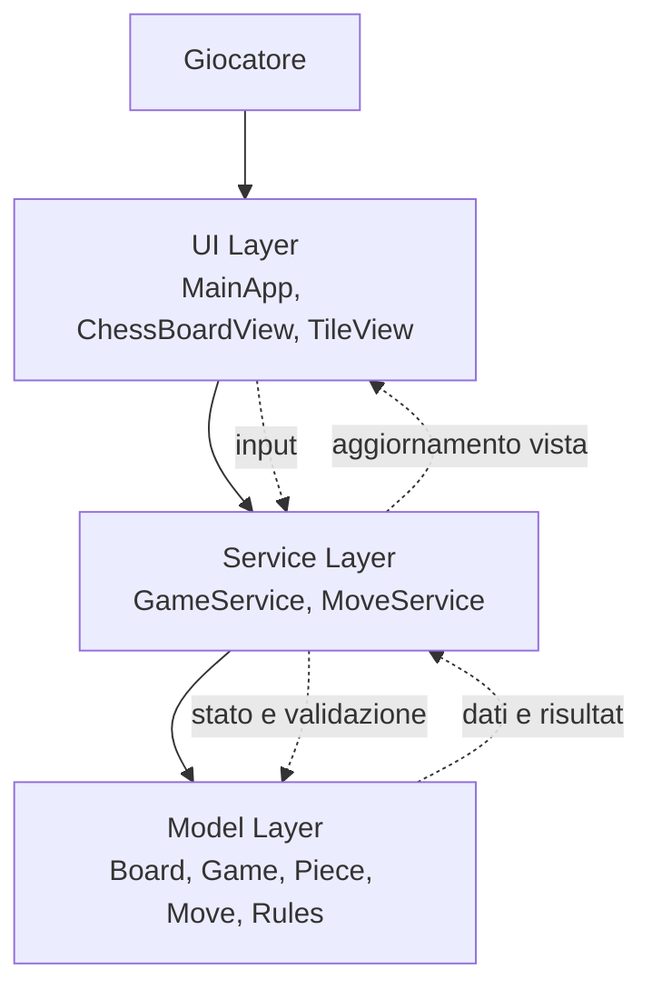

# ♔ Chess

## Documentazione Tecnica Completa

Progetto JavaFX per una partita a scacchi completa in locale, sviluppato con Java 24 e OpenJFX 26.

Autore: Alessandro Previtali
Anno accademico: 2024/2025

## 1. Panoramica del progetto

Chess è un'applicazione desktop sviluppata in Java con interfaccia grafica JavaFX. Implementa una partita a scacchi completa per due giocatori in locale, con validazione delle mosse secondo le regole ufficiali FIDE.

Il progetto adotta un'architettura a strati con separazione tra modello del dominio, logica di business e presentazione. L'obiettivo didattico principale è mostrare l'uso dei principi OOP: ereditarietà, polimorfismo, astrazione e incapsulamento.

### 1.1 Funzionalità implementate

- Mosse complete per tutti i pezzi: Re, Regina, Torre, Alfiere, Cavallo e Pedone.
- Rilevamento di scacco, scacco matto e stallo.
- Arrocco lato re e lato donna.
- Promozione automatica del pedone a Regina.
- Evidenziazione del pezzo selezionato.
- Evidenziazione delle mosse disponibili.
- Lampeggio del re sotto scacco.
- Pulsante per iniziare una nuova partita.

## 2. Struttura del progetto

### 2.1 Package e responsabilità

Il progetto è organizzato nel package root `main.java.com.alessandroprevitali.chess`:

- `app`: avvio dell'applicazione JavaFX.
- `model.board`: board, tile e coordinate.
- `model.game`: stato della partita e gestione del turno.
- `model.move`: oggetti mossa e validazione base.
- `model.piece`: gerarchia dei pezzi.
- `model.rules`: regole speciali e stato partita.
- `service`: orchestrazione della logica di gioco.
- `ui.component`: componenti grafici personalizzati.
- `ui.controller`: controller FXML.
- `ui.view`: file FXML.
- `util`: costanti e utility.

### 2.2 Architettura a strati

Il flusso del sistema è unidirezionale:

UI Layer (JavaFX) → Service Layer → Model Layer

- UI Layer: `MainApp`, `ChessBoardView`, `TileView`.
- Service Layer: `GameService`, `MoveService`.
- Model Layer: tutti i package `model.*`.

La UI si occupa della visualizzazione e degli input, il service della validazione e dell'applicazione delle mosse, il model del dominio puro.

### 2.3 Schema dell'architettura



Schema sintetico del flusso:

- Il giocatore interagisce con la UI.
- La UI invia eventi e richieste al service.
- Il service valida le mosse e aggiorna il modello.
- Il modello restituisce lo stato corretto della partita.
- La UI si ridisegna in base al nuovo stato.

## 3. Modello del dominio

### 3.1 Board, Tile, Position

La classe `Board` rappresenta la scacchiera 8x8.

```java
private Tile[][] tiles = new Tile[8][8];
```

Ogni cella è un oggetto `Tile`, che contiene una `Position` e un eventuale `Piece`.

`Position` rappresenta le coordinate interne della scacchiera ed è usata per confrontare le mosse legali.

Regole di colore della casella:

- chiara se `(r + c) % 2 == 0`
- scura se `(r + c) % 2 != 0`

### 3.2 Inizializzazione della board

La board viene inizializzata con pezzi neri in alto e pezzi bianchi in basso.

```java
private void initializePieces() {
    setPiece(0, 0, new Rook(Color.BLACK, new Position(0, 0)));
    setPiece(0, 1, new Knight(Color.BLACK, new Position(0, 1)));
    setPiece(0, 2, new Bishop(Color.BLACK, new Position(0, 2)));
    setPiece(0, 3, new Queen(Color.BLACK, new Position(0, 3)));
    setPiece(0, 4, new King(Color.BLACK, new Position(0, 4)));
    setPiece(0, 5, new Bishop(Color.BLACK, new Position(0, 5)));
    setPiece(0, 6, new Knight(Color.BLACK, new Position(0, 6)));
    setPiece(0, 7, new Rook(Color.BLACK, new Position(0, 7)));
}
```

### 3.3 Gerarchia dei pezzi

Tutti i pezzi estendono la classe astratta `Piece`.

```java
public abstract class Piece {
    protected Color color;
    protected Position position;
    protected boolean hasMoved;

    public abstract List<Move> getPseudoLegalMoves(Board board);
    public abstract PieceType getType();
}
```

Il metodo `getPseudoLegalMoves()` è il centro del polimorfismo: ogni pezzo calcola le proprie mosse geometricamente corrette senza verificare lo scacco al proprio re.

### 3.4 Il flag `hasMoved`

Il campo `hasMoved` viene impostato da `GameService.applyMove()` alla prima mossa del pezzo. Serve per:

- abilitare il doppio passo iniziale del pedone
- abilitare l'arrocco per re e torre

## 4. Logica di movimento dei pezzi

### 4.1 Pezzi a scorrimento lineare

Torre, Alfiere e Regina usano lo stesso principio: si scorre la board in una direzione finché non si incontra un ostacolo.

```java
private void addLineMoves(Board board, List<Move> moves, int rowStep, int colStep) {
    int row = position.getRow() + rowStep;
    int col = position.getCol() + colStep;

    while (isInsideBoard(row, col)) {
        Piece target = board.getTile(row, col).getPiece();
        if (target == null) {
            moves.add(new Move(position, new Position(row, col)));
        } else {
            if (target.getColor() != color) {
                moves.add(new Move(position, new Position(row, col)));
            }
            break;
        }
        row += rowStep;
        col += colStep;
    }
}
```

Questa logica permette sia il movimento libero sia la cattura di un pezzo avversario, fermandosi subito dopo l'ostacolo.

### 4.2 Cavallo

Il cavallo è l'unico pezzo che salta gli altri pezzi.

```java
int[][] jumps = {
    {-2, -1}, {-2, 1},
    {-1, -2}, {-1, 2},
    {1, -2}, {1, 2},
    {2, -1}, {2, 1}
};
```

Per ogni salto si controlla solo che la casella finale sia dentro la board e non occupata da un pezzo alleato.

### 4.3 Re e arrocco

Il Re si muove di una casella in tutte le direzioni. Se non ha mai mosso, può tentare l'arrocco.

Condizioni base per l'arrocco:

- il re non ha ancora mosso
- la torre del lato scelto non ha ancora mosso
- le caselle tra re e torre sono vuote

Il controllo che il re non attraversi caselle sotto attacco viene verificato in `MoveService.isCastlingPathSafe()`.

### 4.4 Pedone

Il pedone è il pezzo più particolare:

- avanza solo in una direzione
- cattura in diagonale
- può fare il doppio passo iniziale

```java
int direction = (color == Color.WHITE) ? -1 : 1;
int startRow = (color == Color.WHITE) ? 6 : 1;
```

La promozione non viene gestita nel pedone, ma in `GameService.applyMove()`: quando un pedone raggiunge l'ultima traversa, viene sostituito automaticamente con una `Queen`.

## 5. Workflow di una mossa

### 5.1 Sequenza completa

Quando il giocatore clicca su una casella, il sistema segue questa catena:

1. `ChessBoardView.handleClick(row, col)`
2. `GameService.getLegalMoves(piece)`
3. `GameService.handleMove(move)`
4. `MoveService.isValid(move, game)`
5. `GameService.applyMove(move)`
6. `GameService.updateGameState()`
7. `ChessBoardView.refresh()` e `MainApp.onMove()`

### 5.2 Schema riassuntivo

Click → selezione → calcolo mosse legali → secondo click → validazione → applicazione mossa → aggiornamento stato → refresh UI

## 6. Validazione delle mosse

`MoveService` contiene tutta la logica di controllo della legittimità di una mossa.

### 6.1 I quattro controlli di `isValid()`

#### Controllo 1: pezzo presente e turno corretto

```java
private boolean isPiecePresentAndOnTurn(Piece piece, Game game) {
    if (piece == null) {
        return false;
    }

    Color currentTurn = game.getTurnManager().isWhiteTurn() ? Color.WHITE : Color.BLACK;
    return piece.getColor() == currentTurn;
}
```

#### Controllo 2: mossa pseudo-legale

```java
private boolean isPseudoLegalTarget(Move move, Piece piece, Board board) {
    for (Move pseudoMove : piece.getPseudoLegalMoves(board)) {
        if (pseudoMove.getTo().equals(move.getTo())) {
            return true;
        }
    }
    return false;
}
```

#### Controllo 3: percorso sicuro per l'arrocco

```java
private boolean isCastlingPathSafe(Move move, Color movingColor, Board board) {
    if (CheckDetector.isInCheck(movingColor, board)) {
        return false;
    }

    int fromRow = move.getFrom().getRow();
    int fromCol = move.getFrom().getCol();
    int toCol = move.getTo().getCol();
    int step = (toCol > fromCol) ? 1 : -1;

    if (isKingInCheckAfterTemporaryMove(fromRow, fromCol, fromCol + step, movingColor, board)) {
        return false;
    }

    return !isKingInCheckAfterTemporaryMove(fromRow, fromCol, toCol, movingColor, board);
}
```

#### Controllo 4: la mossa non lascia il re in scacco

Il sistema simula la mossa sulla board, verifica se il re è esposto, poi ripristina la posizione originale. Questo pattern è noto come make/unmake.

## 7. Scacco, matto e stallo

### 7.1 `CheckDetector.isInCheck()`

Il metodo controlla se il re di un certo colore è sotto attacco.

```java
public static boolean isInCheck(Color kingColor, Board board) {
    Position kingPos = findKing(kingColor, board);
    Color opponent = (kingColor == Color.WHITE) ? Color.BLACK : Color.WHITE;

    for (int r = 0; r < 8; r++) {
        for (int c = 0; c < 8; c++) {
            Piece p = board.getTile(r, c).getPiece();
            if (p != null && p.getColor() == opponent) {
                for (Move m : p.getPseudoLegalMoves(board)) {
                    if (m.getTo().equals(kingPos)) {
                        return true;
                    }
                }
            }
        }
    }

    return false;
}
```

### 7.2 Aggiornamento dello stato partita

Dopo ogni mossa, il sistema verifica se il giocatore avversario ha mosse legali disponibili.

- se è sotto scacco e non ha mosse legali: `CHECKMATE`
- se non è sotto scacco e non ha mosse legali: `STALEMATE`
- se è sotto scacco ma ha mosse legali: `CHECK`
- altrimenti: `ONGOING`

### 7.3 `hasAnyLegalMoves()`

Questa funzione verifica se il giocatore ha almeno una mossa legale disponibile. È più costosa, ma sufficiente per un progetto didattico.

## 8. Interfaccia grafica JavaFX

### 8.1 Componenti principali

- `MainApp`: costruisce la finestra principale.
- `ChessBoardView`: mostra la scacchiera e gestisce i click.
- `TileView`: rappresenta una singola casella.

### 8.2 Sistema a due click

L'interazione avviene con due click:

- primo click: selezione del pezzo
- secondo click: scelta della destinazione

Se il secondo click è su un altro pezzo alleato, la selezione cambia. Se è su una casella non valida, la selezione viene annullata.

### 8.3 Animazioni

- Lampeggio rosso del re sotto scacco.
- Fade-in del testo di stato al cambio turno.
- Fade-in della scacchiera al reset della partita.

## 9. Gestione dello stato di partita

### 9.1 `GameState`

Gli stati possibili sono:

- `ONGOING`
- `CHECK`
- `CHECKMATE`
- `STALEMATE`

### 9.2 `TurnManager`

`TurnManager` mantiene il turno corrente con un semplice flag booleano. Dopo ogni mossa valida, il turno viene invertito.

### 9.3 Ciclo di vita della partita

`Game() -> ONGOING -> CHECK -> CHECKMATE/STALMATE -> reset() -> ONGOING`

## 10. Codice principale

### 10.1 Entry point

`AppLauncher` è il punto di avvio dell'applicazione.

```java
public class AppLauncher {
    public static void main(String[] args) {
        MainApp.main(args);
    }
}
```

### 10.2 Avvio della UI

`MainApp` crea layout, pulsante di nuova partita, barra stato e scacchiera.

### 10.3 Gestione delle mosse

`GameService` applica la mossa, aggiorna lo stato e resetta la partita quando necessario.

## 11. Configurazione e avvio del progetto

### 11.1 Requisiti

- JDK 24
- OpenJFX 26
- IDE con supporto JavaFX

### 11.2 IntelliJ IDEA

Il progetto usa `Scacchi.iml` e una configurazione già predisposta nel workspace. Se il percorso di JavaFX cambia, va aggiornato il parametro `--module-path`.

### 11.3 VM options

```text
--module-path C:\Users\PcAle\Java\openjfx-26_windows-x64_bin-sdk\javafx-sdk-26\lib --add-modules javafx.controls,javafx.fxml
```

### 11.4 Classe di avvio

La main class da usare è `main.java.com.alessandroprevitali.chess.app.AppLauncher`.

## 12. Limitazioni e sviluppi futuri

### 12.1 Funzionalità non implementate

- En passant
- Salvataggio e caricamento partita
- Cronologia mosse persistente

### 12.2 Note tecniche

- `hasAnyLegalMoves()` può risultare costosa perché simula e annulla molte mosse.
- Il flag `hasMoved` non è pensato per la serializzazione.
- L'architettura attuale è comunque pronta per ulteriori estensioni.

### 12.3 Estendibilità

Per aggiungere un nuovo pezzo basta creare una classe che estende `Piece`, implementare `getPseudoLegalMoves()` e `getType()`, poi aggiungere l'inizializzazione nella `Board`.

## 13. Glossario

- Pseudo-mossa: mossa corretta dal punto di vista geometrico, ma non ancora filtrata rispetto allo scacco.
- Mossa legale: mossa valida anche rispetto allo stato del re.
- Make/unmake: tecnica che simula una mossa, esegue un controllo, poi ripristina la posizione.
- Arrocco: mossa speciale che coinvolge re e torre.
- Promozione: sostituzione del pedone arrivato in ultima traversa con un pezzo superiore, qui una Regina.
